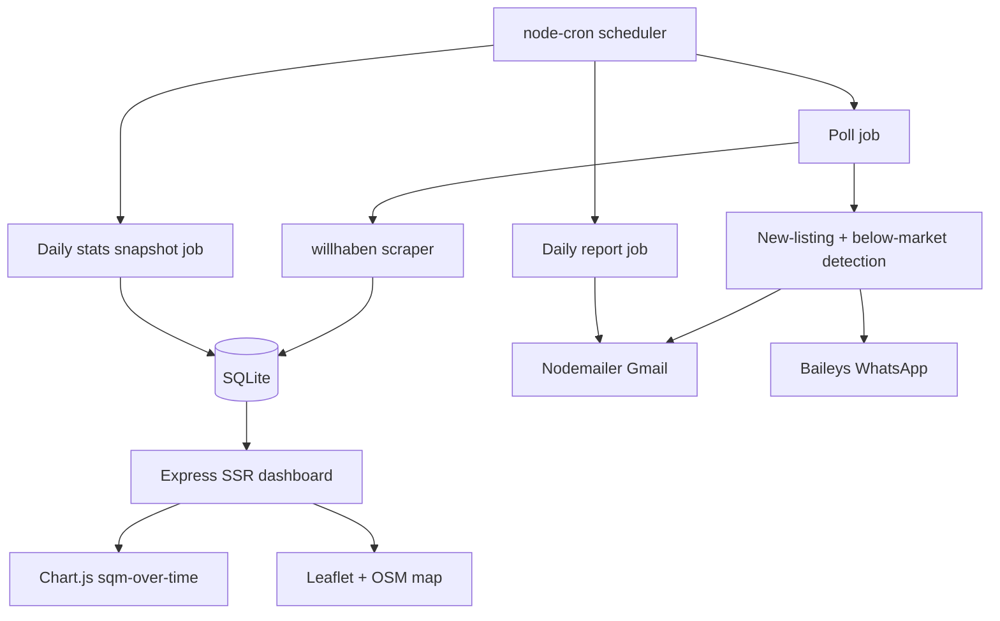

## Vienna Apartment Scraper & Alerting Service

### Goal
A Dockerized Node.js app that polls willhaben.at on a schedule, persists listings to SQLite, computes per-district sqm price stats over time, visualizes them (charts + map), emails a daily report, and fires email + WhatsApp alerts on below-market offers.

### Confirmed stack decisions
- Scraper: self-hosted, hitting willhaben's internal JSON (free, full control)
- DB: SQLite via `better-sqlite3` (recommended below)
- WhatsApp: `@whiskeysockets/baileys` (unofficial, free, lightest for Docker)
- Maps: Leaflet + OpenStreetMap (no key)
- Email: `nodemailer` over Gmail SMTP (app password)
- Dashboard: server-rendered HTML (Express) + Chart.js & Leaflet via CDN
- Deploy: Docker (single service + volume)

### Development strategy: Test-Driven Development (TDD)
- Every module is built test-first: write a failing unit test that captures the desired behavior, implement the minimum code to pass, then refactor (red -> green -> refactor). Applies to scraper parsing, db dedup/queries, stats aggregation, alert rules, report rendering, and config.
- Test runner: Vitest (fast, ESM-friendly, built-in coverage via `@vitest/coverage-v8`). Pure logic is unit-tested directly; I/O (HTTP, SMTP, WhatsApp socket, filesystem) is injected/mocked so it stays unit-level.
- Coverage gate: an npm script runs the full suite with coverage and fails the build if thresholds are not met.
  - `npm run test:coverage` -> `vitest run --coverage`.
  - `npm test` -> `vitest run` (fast feedback during the red/green loop).
- Configurable thresholds live in a source file `src/test/coverage.config.js` (single source of truth), e.g.:

```js
export default {
  // required coverage percentages; build fails below these
  lines: 90,
  branches: 90,
  functions: 90,
  statements: 90,
};
```

  - `vitest.config.js` imports this file and feeds it into `test.coverage.thresholds`, so both line-of-code percentage and branch testability are enforced (functions/statements included for completeness).
- Workflow rule: after `npm run test:coverage`, if any metric is below its configured threshold, add/extend tests until it passes - no lowering thresholds to go green.

### Why SQLite
The dataset is small (a few hundred active listings, ~tens of new/day). SQLite handles relational queries, time-series aggregation (`GROUP BY date(...)`), and stores lat/lng + raw JSON in one file - no extra container. Easy upgrade path to Postgres later if needed. Influx/Mongo/Cassandra are overkill here.

### Data source notes (willhaben)
- Target search: rental apartments (`Mietwohnungen`), Vienna, 1-2 rooms, districts 2,3,6,7,8,9,17,18,19.
- District -> postal code filter: 2=1020, 3=1030, 6=1060, 7=1070, 8=1080, 9=1090, 17=1170, 18=1180, 19=1190.
- Approach: build search result URLs with filters, then read the listings JSON embedded in the page (`__NEXT_DATA__`) or the `webapi/iad/search` JSON endpoint, paginate, and follow each listing's public detail JSON for area/rooms/GPS when missing.
- Per listing extract: `id`, `url`, `title`, `price` (gross rent), `area_m2`, `rooms`, `postcode/district`, `lat/lng`, `publishedAt`.
- Be polite: low frequency (e.g. every 30-60 min), realistic headers, small concurrency, retry/backoff. Personal/private use only.
- Transaction type (rent vs buy) will be a config flag; default = rent.

### Architecture


### Database schema (SQLite)
- `listings`: `id` (willhaben id, PK), `first_seen_at`, `last_seen_at`, `is_active`, `title`, `url`, `district`, `postcode`, `rooms`, `area_m2`, `price`, `price_per_m2`, `lat`, `lng`, `raw_json`.
- `district_daily_stats`: `date`, `district`, `avg_price_per_m2`, `median_price_per_m2`, `active_count` (PK = date+district). Snapshotted daily so the time-series chart is stable and cheap.
- `alerts_sent`: `listing_id`, `type`, `sent_at` (dedup so we never alert twice).

### Alerting logic
- On each poll, new listings (unseen `id`) are inserted.
- Baseline per district = trailing median `price_per_m2` from `district_daily_stats` (configurable window).
- If a new listing's `price_per_m2 < baseline * (1 - threshold)` (e.g. 15% below district median), enqueue an alert -> send email + WhatsApp, record in `alerts_sent`.

### Dashboard (server-rendered)
- `GET /` overview: today's new listings + summary stats.
- `GET /trends`: Chart.js line chart of median sqm price per district over time (data from a small JSON route).
- `GET /map`: Leaflet/OSM map with listing markers, colored by price vs district median; popup with title/price/area/link.
- Lightweight: Express + a templating approach (EJS) or plain template strings; charts/map libs loaded from CDN, data injected as JSON.

### Daily report
- `node-cron` at e.g. 08:00 local: collect listings with `first_seen_at` in last 24h, render HTML email (grouped by district, with sqm price + delta vs district median), send via Gmail SMTP.

### Proposed project structure
- `src/config.js` - districts, thresholds, intervals, env loading
- `src/scraper/willhaben.js` - search URL builder, fetch, parse, normalize
- `src/db/index.js`, `src/db/schema.sql` - connection + migrations + queries
- `src/jobs/poll.js`, `src/jobs/computeStats.js`, `src/jobs/dailyReport.js`
- `src/alerts/rules.js`, `src/alerts/email.js`, `src/alerts/whatsapp.js`
- `src/web/server.js`, `src/web/views/*`
- `index.js` - boots scheduler + web server
- `src/test/coverage.config.js` - configurable coverage thresholds (lines/branches/functions/statements)
- `vitest.config.js` - imports coverage thresholds; `test/**` for specs and fixtures
- `Dockerfile`, `docker-compose.yml` (app service + volume for `data/` SQLite and Baileys auth)
- `.env.example`, `README.md`

### Config (.env)
- `POLL_INTERVAL_CRON`, `DISTRICTS`, `TRANSACTION_TYPE`, `ROOMS_MIN/MAX`
- `ALERT_THRESHOLD_PCT`, `STATS_WINDOW_DAYS`
- `SMTP_USER`, `SMTP_PASS`, `ALERT_EMAIL_TO`, `REPORT_EMAIL_TO`
- `WHATSAPP_TO` (number), Baileys auth stored in a volume
- `PORT`

### Verification
- TDD throughout (write the spec first); gate with `npm run test:coverage` which must pass the thresholds in `src/test/coverage.config.js` (default 90% lines + branches).
- Scraper: unit test parsing on a saved willhaben JSON fixture -> normalized objects with non-null area/price/district.
- DB: insert + dedup test; stats aggregation test against seeded rows.
- Alerts: rule test with synthetic listings above/below baseline; email and WhatsApp senders tested with mocked transports; first real WhatsApp run needs a QR scan.
- Dashboard: route/handler tests with seeded data; manual check that `/trends` and `/map` render.
- End-to-end: `docker compose up`, confirm a poll writes rows and the dashboard loads.

### Notes / risks
- willhaben has no official API and may change its JSON structure or add anti-bot measures; the parser is isolated so it's easy to fix. Keep request volume low.
- Baileys uses an unofficial WhatsApp connection (small ban risk); requires a one-time QR scan and a persistent volume for the session.
